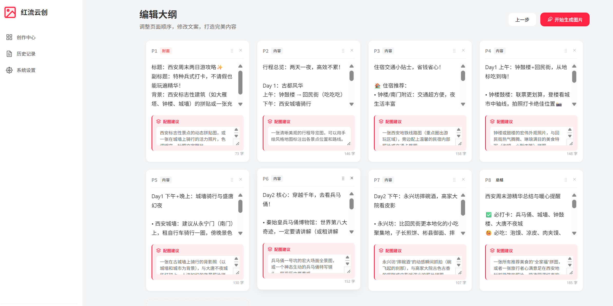
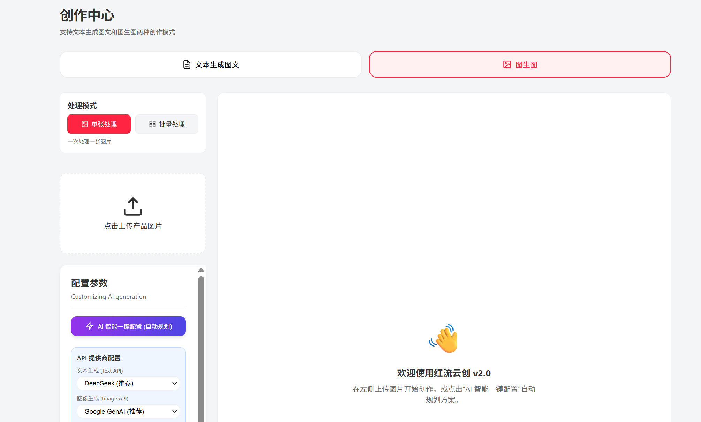
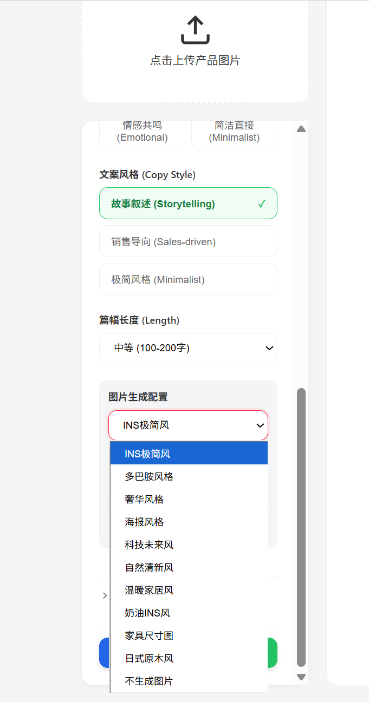

# 红流云创 v2.1 —— 别再用命P图了，AI替你上班

<div align="center">

**运营人员的福音-AI图文创作助手**

[功能特性](#功能特性) • [快速开始](#快速开始) • [服务器部署](#服务器部署) • [Docker部署](#docker部署) • [贡献指南](./CONTRIBUTING.md) • [更新日志](./CHANGELOG.md)

[](https://opensource.org/licenses/MIT)
[](https://vuejs.org/)
[](https://www.typescriptlang.org/)

</div>

## 项目简介

### 红流云创 v2.1 —— 别再用命P图了，AI替你上班

还在为小红书爆文熬夜磕图、文案删了又改？  
一张图扣一天，眼快瞎了流量还挂零？  
别修仙了，你缺的不是肝，是像样的工具。

**红流云创**专治各种"创作内耗"，用AI把小红书图文流水线塞进键盘里：  

- **🧠 文生图+文**：输入一个念头，AI直接吐出一套完整图文大纲+配图建议，连海报都给你批量生成好。别想了，你就是 prompt 工程师。  
- **🖼️ 图生图文**：丢一张产品实拍图进来，AI当场解构卖点、编好营销话术，再甩你几张直接能发的风格化配图。别P了，让AI卷。  

我们负责自动化，你负责发。  
流量不该用命换，效率才是正经事。

## 效果展示

### 文本生成图文模式

<div align="center">

#### 1. 输入主题生成大纲


#### 2. 编辑大纲和配图建议


#### 3. 批量生成海报图片


</div>

### 图生图模式

<div align="center">

#### 1. 上传产品图片


#### 2. AI分析产品特征


#### 3. 生成营销文案和风格化图片


</div>

### 历史记录

<div align="center">


</div>

> 💡 **提示**: 以上示例图片需要您自行添加。将截图保存到 `docs/images/` 目录，并按照上述命名规范命名即可。

## 技术栈

- **前端框架**: Vue 3 + TypeScript
- **路由**: Vue Router 4
- **状态管理**: Pinia
- **构建工具**: Vite
- **API服务**:
  - 文本生成: DeepSeek API
  - 图片生成: Google GenAI API

## 项目结构

```
v2/
├── src/
│   ├── assets/          # 静态资源
│   │   └── css/        # 样式文件
│   ├── components/     # 组件
│   │   ├── ui/         # UI组件库
│   │   ├── layout/     # 布局组件
│   │   └── common/      # 通用组件
│   ├── composables/    # 组合式函数
│   ├── config/         # 配置文件
│   ├── router/         # 路由配置
│   ├── services/       # 服务层
│   │   ├── ai/         # AI服务模块
│   │   └── storage/    # 存储服务
│   ├── stores/         # 状态管理
│   ├── types/          # TypeScript类型定义
│   ├── utils/          # 工具函数
│   ├── views/          # 页面视图
│   ├── App.vue         # 根组件
│   └── main.ts         # 入口文件
├── docker/             # Docker配置文件
├── .github/            # GitHub模板
├── Dockerfile.nginx    # Nginx部署文件
├── Dockerfile.node     # Node.js部署文件
├── docker-compose.yml  # Docker Compose配置
└── package.json
```

## 安装和运行

### 1. 安装依赖

```bash
cd 02.红流云创/v2
npm install
```

### 2. 配置API密钥

在浏览器中打开应用后，进入"系统设置"页面，配置以下API密钥：

- **DeepSeek API Key**: 用于文本生成
  - 获取地址: https://platform.deepseek.com/
  - 配置项: `DEEPSEEK_API_KEY`

- **Google GenAI API Key**: 用于图片生成
  - 获取地址: https://aistudio.google.com/app/apikey
  - 配置项: `GOOGLE_API_KEY`

### 3. 启动开发服务器

```bash
npm run dev
```

应用将在 `http://localhost:5174` 启动

### 4. 构建生产版本

```bash
npm run build
```

构建产物将输出到 `dist/` 目录。

## 服务器部署

**📚 详细部署指南**: 请查看 [服务器部署文档](./docs/DEPLOYMENT.md)，包含以下部署方案：

- 🐳 **Docker 部署**（推荐，最简单）
- 🌐 **Nginx 直接部署**（性能最佳）
- 🟢 **Node.js + PM2 部署**（便于扩展）
- 🔒 **Nginx + HTTPS 部署**（生产环境推荐）

### 快速部署（Docker）

```bash
# 1. 上传项目到服务器
# 2. 进入项目目录
cd /opt/redflow-v2

# 3. 使用 Docker Compose 一键部署
docker-compose -f docker-compose.nginx.yml up -d --build

# 4. 访问应用
# http://your-server-ip:8080
```

⚠️ **重要提示**: 如果更新代码后部署的还是旧版本，必须使用 `--no-cache` 强制重新构建：

```bash
# 使用强制部署脚本（推荐）
chmod +x deploy-force.sh
./deploy-force.sh

# 或手动强制重新构建
docker-compose -f docker-compose.nginx.yml down
docker-compose -f docker-compose.nginx.yml build --no-cache
docker-compose -f docker-compose.nginx.yml up -d
```

### 快速部署脚本

```bash
# 使用部署脚本（自动构建并部署）
chmod +x deploy.sh
./deploy.sh docker    # Docker 部署

# 如果更新代码后还是旧版本，使用强制部署脚本
chmod +x deploy-force.sh
./deploy-force.sh     # 强制重新构建，不使用缓存

# 其他部署方式
./deploy.sh nginx     # Nginx 部署
./deploy.sh node      # Node.js 部署
```

> 💡 **提示**: 部署后，每个用户需要在浏览器中配置自己的 API 密钥。如需统一管理 API 密钥，请参考部署文档中的"后端 API 代理"方案。

## Docker部署

项目支持两种Docker部署方式，详细说明请参考 [Docker部署文档](./docker/README.md)。

### 方式一：Nginx静态文件部署（推荐）

```bash
# 使用docker-compose
docker-compose -f docker-compose.nginx.yml up -d

# 或直接构建运行
docker build -f Dockerfile.nginx -t redflow-nginx .
docker run -d -p 8080:80 --name redflow-nginx redflow-nginx
```

访问：http://localhost:8080

### 方式二：Node.js服务器部署

```bash
# 使用docker-compose
docker-compose -f docker-compose.node.yml up -d

# 或直接构建运行
docker build -f Dockerfile.node -t redflow-node .
docker run -d -p 3000:3000 --name redflow-node redflow-node
```

访问：http://localhost:3000

### 环境变量

- `PORT`: 服务端口（Nginx默认8080，Node.js默认3000）
- `NODE_ENV`: 环境变量（默认production）

## 功能特性

### 文本生成图文模式
- 输入创意主题
- AI生成小红书风格图文大纲
- 支持多页面内容生成
- 批量生成海报图片
- 编辑大纲和配图建议
- 一键下载完整内容（文字+图片）

### 图生图模式
- 上传产品图片
- AI分析产品特征（颜色、材质、类别等）
- 生成营销文案
- 生成风格化产品图片
- 支持多种风格选择

### 历史记录
- 自动保存创作历史
- 查看历史作品详情
- 本地存储（最多20条）
- 优化保存逻辑，确保数据完整性

### 系统设置
- API密钥配置
- 本地存储管理
- 配置即时生效

## API配置说明

### DeepSeek API
- **默认端点**: `https://api.deepseek.com/chat/completions`
- **默认模型**: `deepseek-chat`
- **支持自定义端点和模型**

### Google GenAI API
- **获取地址**: https://aistudio.google.com/app/apikey
- **图片生成模型**: `gemini-2.5-flash-image`
- **文本分析模型**: `gemini-2.5-flash`

## 开发计划

- [x] 基础项目结构
- [x] 路由和布局
- [x] API服务集成（DeepSeek + Google）
- [x] 图生图功能
- [x] 文本生成大纲功能
- [x] 历史记录功能
- [x] 设置界面
- [x] 完善UI组件库
- [x] Docker部署支持
- [x] 单元测试框架
- [x] 一键下载功能（文字+图片）
- [x] 完成提示模态框
- [ ] 图片生成流程优化
- [ ] 深色模式支持

## 注意事项

1. **API密钥安全**: 所有API密钥存储在浏览器本地存储中，不会上传到服务器
2. **存储限制**: 历史记录最多保存20条，超出会自动删除最旧的记录
3. **图片压缩**: 上传的图片会自动压缩以节省存储空间
4. **网络要求**: 需要能够访问DeepSeek和Google API服务

<!-- 历史版本对比信息已移除，当前文档仅聚焦红流云创 v2 本身功能 -->

## 测试

```bash
# 运行测试
npm test

# 运行测试并查看覆盖率
npm run test:coverage

# 运行测试UI
npm run test:ui
```

## 贡献

我们欢迎所有形式的贡献！请查看 [贡献指南](./CONTRIBUTING.md) 了解详细信息。

### 贡献方式

- 🐛 [报告Bug](./.github/ISSUE_TEMPLATE/bug_report.md)
- 💡 [提出功能建议](./.github/ISSUE_TEMPLATE/feature_request.md)
- 📝 [提交代码](./CONTRIBUTING.md#提交代码)
- 📖 [改进文档](./CONTRIBUTING.md)

## 常见问题（FAQ）

### Q: API密钥安全吗？

A: 所有API密钥存储在浏览器本地存储（localStorage）中，不会上传到任何服务器。请妥善保管您的API密钥。

### Q: 支持哪些浏览器？

A: 支持所有现代浏览器（Chrome、Firefox、Safari、Edge等），需要支持ES6+和Vue 3。

### Q: 如何备份历史记录？

A: 历史记录存储在浏览器本地，可以通过浏览器的导出功能备份，或使用浏览器的同步功能。

### Q: 图片生成失败怎么办？

A: 请检查：
1. API密钥是否正确配置
2. 网络连接是否正常
3. API服务是否可用
4. 查看浏览器控制台的错误信息

## 许可证

本项目采用 [MIT许可证](./LICENSE) 开源。

## 致谢

- [Vue.js](https://vuejs.org/) - 渐进式JavaScript框架
- [Vite](https://vitejs.dev/) - 下一代前端构建工具
- [DeepSeek](https://platform.deepseek.com/) - AI文本生成服务
- [Google GenAI](https://aistudio.google.com/) - AI图片生成服务

## 相关链接

- [更新日志](./CHANGELOG.md)
- [贡献指南](./CONTRIBUTING.md)
- [服务器部署文档](./docs/DEPLOYMENT.md)
- [Docker部署文档](./docker/README.md)
- [问题反馈](https://github.com/your-username/redflow-v2/issues)
